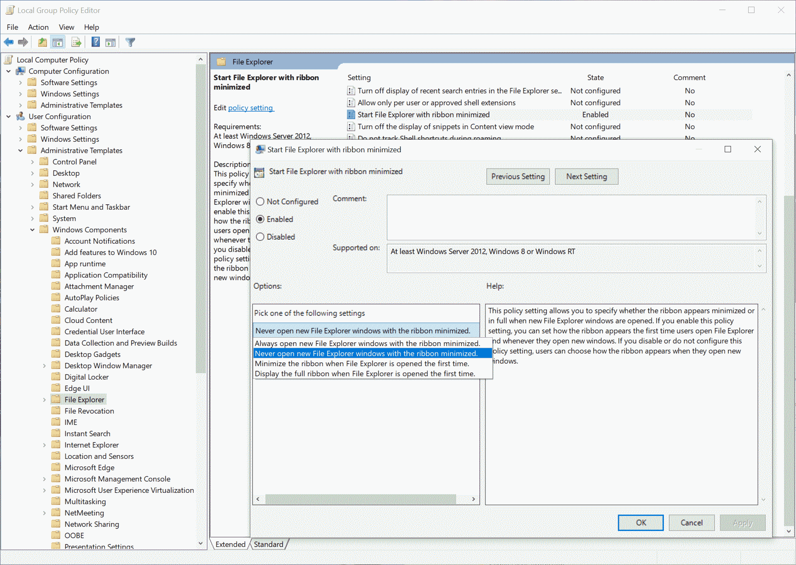

# Local Group Policy

Local Group Policy is a Windows feature that allows system administrators (or local users) to manage and configure various system, security, and application settings on a single computer. It provides a user interface to set policies that control operating system behavior without needing to modify the Windows registry directly. This includes settings for system updates, security restrictions, software installation, and more.

## Where do they come from
Windows and 3rd parties can provide policy-definitions in form of *.admx files (and *.adml files for language support), located in %WinDir%\PolicyDefinitions. These xml-files describes the policies and their purpose, also the possible values including range.
Example:
```xml
<policy name="ExplorerRibbonStartsMinimized"
        class="Both"
        displayName="$(string.ExplorerRibbonStartsMinimized_DisplayName)"
        explainText="$(string.ExplorerRibbonStartsMinimized_ExplainText)"
        presentation="$(presentation.ExplorerRibbonStartsMinimized)"
        key="Software\Policies\Microsoft\Windows\Explorer"
        valueName="ExplorerRibbonStartsMinimized">
    <parentCategory ref="windows:WindowsExplorer" />
    <supportedOn ref="windows:SUPPORTED_Windows8" />
    <elements>
      <enum id="ExplorerRibbonStartsMinimizedDropdown" valueName="ExplorerRibbonStartsMinimized" required="true">
        <item displayName="$(string.ExplorerRibbonStartsMinimized_StartsMinimized)">
          <value>
            <decimal value="1" />
          </value>
        </item>
        <item displayName="$(string.ExplorerRibbonStartsMinimized_StartsNotMinimized)">
          <value>
            <decimal value="2" />
          </value>
        </item>
        <item displayName="$(string.ExplorerRibbonStartsMinimized_InitializedMinimized)">
          <value>
            <decimal value="3" />
          </value>
        </item>
        <item displayName="$(string.ExplorerRibbonStartsMinimized_InitializedNotMinimized)">
          <value>
            <decimal value="4" />
          </value>
        </item>
      </enum>
    </elements>
</policy>
```
Note: not all defined policies are for the current system. Some of them are e.g. defined for Vista only, even if you find them on a Windows 10 system.

## How to handle policies
Typically policies are managed by the system admin via Active-Directory and dedicates server-based tools. They are deployed automatically to all the user devices of a company.
If a system is not AD joined, there is another tool to handle them: GPEdit.msc


Please note that here we are only focusing on 'Administrative Templates' (both Computer/Machine and User Configuration). GPEdit also allows to modify other things like Windows-Settings - they are not policy-based.

## 3 states, 2 classes
A policy can have 3 possible states:
1. **Enabled**<br>
The policy is active and will enforce the value according to the description.
2. **Disabled**<br>
The described topic shall be disabled or switched off
3. **Not Configured**<br>
There is no definiton active at all. That means that there is no template and no values in registry will be modified.

Note:<br>
Many policies are defined with 'inverse logic': If there is a policy "Turn off xxx" 
  - **Enabled** means that the feature xxx is switched off (disabled)
  - **Disabled** means the opposite, feature xxx is on (enabled)

Class:<br>
A policy targets the **machine** and/or the **user** configuration. So the class of a policy can be machine, user or both. (class is usually marked as light blue in LgpCli like <span style="color:skyblue;">machine</span>)

## How do they work
Policies (or their defined values) are stored in the registry. But the story isn't that simple. They are stored in a special part in the registry as a kind of a Template. Such a template describes which values should be written or removed. This template is applied after reboot or after 'gpupdate /force'. This indirection makes sure that the wanted values are really 'persistent'. It is impossible (better: difficult) for a user to just change those values (on along run), because windows will always restore the values based on the stored template.

The real values are also applied to the registry when the policy-template is written (aka the policy's state is changed). However in most cases these values are effective when the system is rebooted.
<br>

>PS: all this is not official or correct, just my understanding.